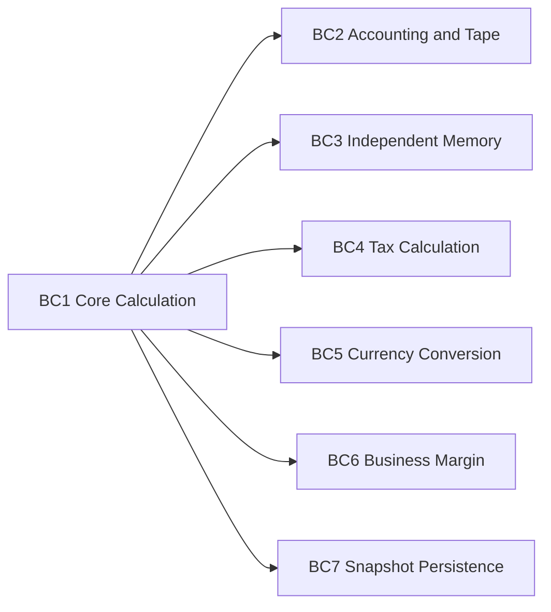
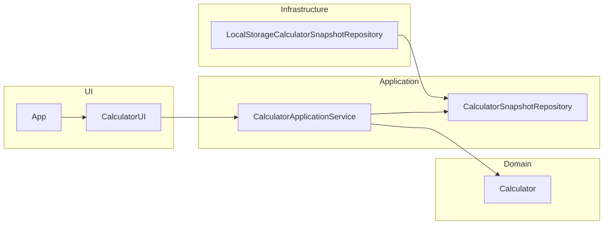
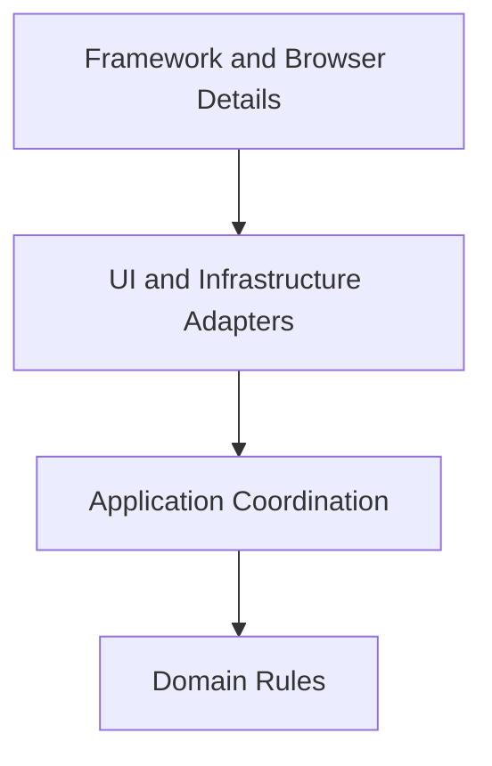

# Casio HR-100TM Calculation Engine

Replica web de una calculadora contable de escritorio inspirada en la `CASIO HR-100TM`. El proyecto no intenta verse como una "demo de botones": su foco es un motor de calculo con reglas operativas, financieras y de persistencia de sesion, expuesto mediante una interfaz React.

## Que hace

- Operaciones aritmeticas con precedencia real entre `+`, `-`, `x` y `/`
- Selector decimal `F`, `3`, `2`, `0` y `ADD2`
- Modos `OFF`, `ON`, `PRINT`, `ITEM` y `CONVERSION`
- Memoria independiente, `grand total`, subtotales y conteo de items
- Impuestos, conversion de moneda y calculos `COST / SELL / MGN`
- Cinta de papel simulada
- Persistencia local con exportacion e importacion de snapshots JSON

## Arquitectura

La implementacion actual sigue una **Clean Architecture ligera**:

- `domain`: reglas puras de la calculadora
- `application`: coordinacion de casos de uso y persistencia
- `infrastructure`: detalles concretos del navegador
- `ui`: adaptadores React para botones, teclado y render

No es una arquitectura corporativa sobredimensionada. El sistema sigue siendo pequeno, pero ahora la separacion entre dominio, aplicacion e infraestructura existe en el codigo y no solo en los diagramas.

Las decisiones principales quedaron documentadas en [docs/adr/README.md](./docs/adr/README.md).

### Mapa de bounded contexts



### Vista de Clean Architecture



### Regla de dependencia



## Estructura del codigo

```text
src/
  application/
    ports/
      CalculatorSnapshotFileGateway.ts
      CalculatorSnapshotRepository.ts
    services/
      CalculatorApplicationService.ts
      CalculatorApplicationService.test.ts
    usecases/
      configureCalculatorMode.ts
      dispatchCalculatorAction.ts
      hydrateCalculatorState.ts
      persistCalculatorState.ts
      transferCalculatorSnapshot.ts
  domain/
    calculator/
      Calculator.ts
      Calculator.test.ts
      state.ts
      types.ts
      policies/
        numericPolicy.ts
        tapePolicy.ts
      services/
        accountingService.ts
        accountingService.test.ts
        businessMath.ts
        currencyConversionService.ts
        currencyConversionService.test.ts
        expressionEvaluator.ts
        expressionEvaluator.test.ts
        sessionStateService.ts
        sessionStateService.test.ts
        taxService.ts
        taxService.test.ts
  infrastructure/
    files/
      BrowserCalculatorSnapshotFileGateway.ts
    persistence/
      LocalStorageCalculatorSnapshotRepository.ts
  ui/
    components/
      CalculatorUI.tsx
      CalculatorUI.css
    keyboard/
      translateCalculatorKeyboardEvent.ts
      translateCalculatorKeyboardEvent.test.ts
  App.tsx
  App.test.tsx
  index.tsx
```

## Responsabilidades reales por capa

### Domain

`src/domain/calculator/`

Aqui vive la logica importante:

- `Calculator.ts`: entidad principal y flujo operacional
- `types.ts`: lenguaje del dominio
- `state.ts`: estado inicial y saneamiento de snapshots
- `policies/numericPolicy.ts`: redondeo, formato y validacion numerica
- `policies/tapePolicy.ts`: reglas de impresion y recorte de cinta
- `services/accountingService.ts`: subtotal, conteo de items y grand total
- `services/businessMath.ts`: resolucion de `COST / SELL / MGN`
- `services/currencyConversionService.ts`: conversion monetaria
- `services/expressionEvaluator.ts`: evaluacion y precedencia de expresiones
- `services/sessionStateService.ts`: limpieza, reinicio y transiciones de error
- `services/taxService.ts`: calculos fiscales

Esta capa no depende de React ni de APIs del navegador.

### Application

`src/application/`

Coordina la sesion de calculo:

- `services/CalculatorApplicationService.ts`: fachada de aplicacion
- `usecases/dispatchCalculatorAction.ts`: despacho de acciones de calculadora
- `usecases/hydrateCalculatorState.ts`: restauracion de estado
- `usecases/persistCalculatorState.ts`: persistencia de estado
- `usecases/configureCalculatorMode.ts`: cambio de modo y selector decimal
- `usecases/transferCalculatorSnapshot.ts`: importacion y exportacion de snapshots
- `ports/CalculatorSnapshotRepository.ts`: puerto de persistencia
- `ports/CalculatorSnapshotFileGateway.ts`: puerto de importacion/exportacion de archivo

Aqui estan los casos de uso ligeros del sistema. La UI ya no contiene la logica de archivo ni el mapeo principal de persistencia; solo invoca la capa de aplicacion.

### Infrastructure

`src/infrastructure/`

- `persistence/LocalStorageCalculatorSnapshotRepository.ts`: persistencia en `localStorage`
- `files/BrowserCalculatorSnapshotFileGateway.ts`: lectura y descarga de snapshots en el navegador

Si mañana cambia el almacenamiento o el mecanismo de archivos, el dominio no necesita enterarse.

### UI

`src/ui/components/CalculatorUI.tsx`

Renderiza la replica visual, captura eventos de botones y teclado, y delega la logica al servicio de aplicacion.

La traduccion de teclado fisico vive en `src/ui/keyboard/translateCalculatorKeyboardEvent.ts`, con pruebas dedicadas para `typing`, numpad, separador decimal y teclas de control.

## Scripts

```bash
npm start
npm test -- --watchAll=false
npm run build
```

## Verificacion actual

- Tests de dominio para `ADD2`, conversion, items, impuestos, negocio y precedencia
- Tests de aplicacion para hidratacion y persistencia
- Tests de UI para render, operacion basica y typing de teclado fisico
- Build de produccion valido con `react-scripts build`

## Limites actuales

- El dominio ya no es un unico archivo, pero `Calculator` sigue siendo el principal orquestador del comportamiento
- Los casos de uso existen como servicio de aplicacion, no como un archivo por comando
- La persistencia actual es local al navegador, sin backend ni sincronizacion externa

Ese alcance es intencional. El proyecto busca una direccion de arquitectura profesional sin fingir complejidad que todavia no existe.

## Siguiente etapa razonable

- separar casos de uso por comando si el dominio sigue creciendo
- seguir fragmentando `Calculator` en agregados o servicios si aparecen nuevos flujos
- agregar pruebas de infraestructura y flujos de importacion/exportacion
- documentar decisiones arquitectonicas como ADRs pequenas
