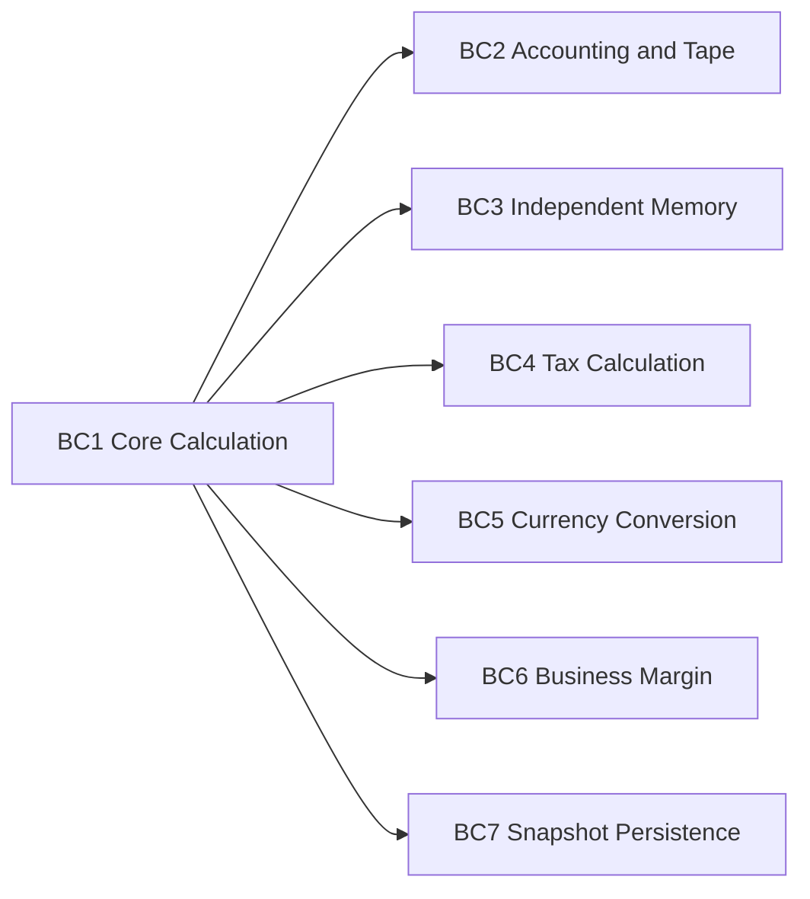
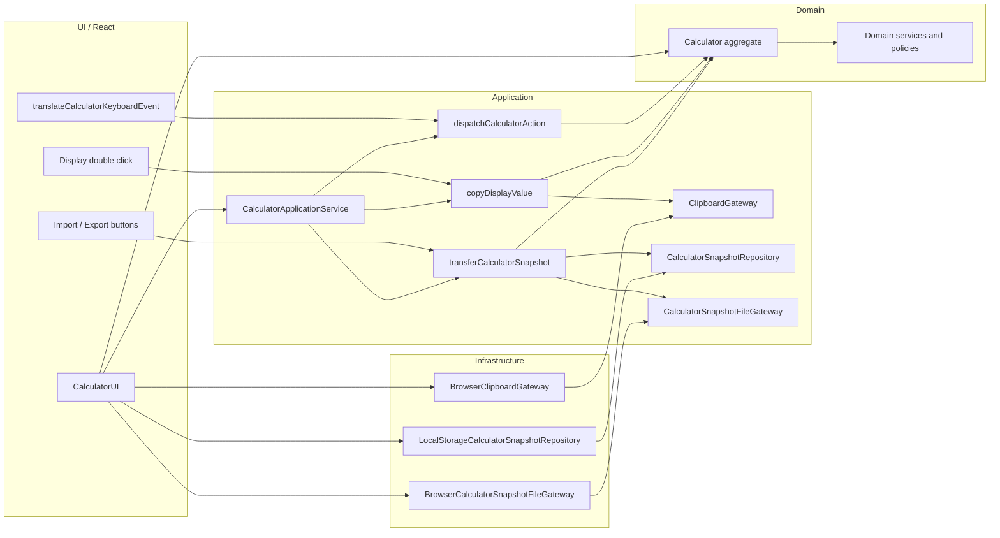
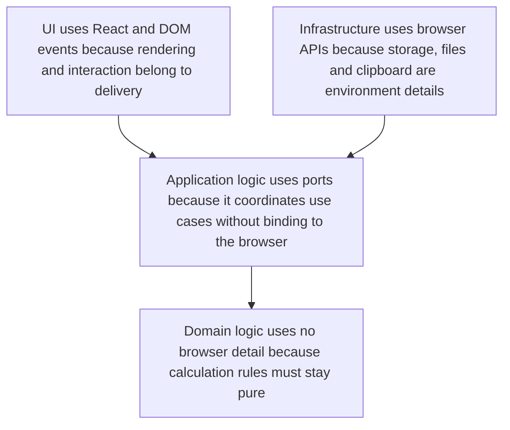
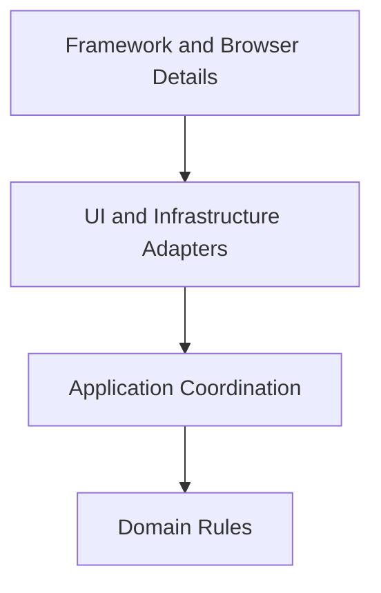

# Sumadora Calculation Engine

Replica web de una calculadora contable de escritorio. El proyecto no intenta verse como una "demo de botones": su foco es un motor de calculo con reglas operativas, financieras y de persistencia de sesion, expuesto mediante una interfaz React.

## Que hace

- Operaciones aritmeticas con precedencia real entre `+`, `-`, `x` y `/`
- Flujo de sumadora para la tecla combinada `+ =`: registra linea, totaliza la secuencia y permite seguir acumulando desde el total impreso
- Selector decimal `F`, `3`, `2`, `0` y `ADD2`
- Conversion y memoria como capacidades directas, sin selector global de modo
- Memoria independiente, `grand total`, subtotales y contadores `OPS` y `SUB`
- Impuestos, conversion de moneda y calculos `COST / SELL / MGN`
- Cinta de papel siempre activa
- Cinta con dos secuencias de dominio: `OP` para renglones operativos y `SUB` para subtotales y gran total
- Persistencia local con exportacion e importacion de snapshots JSON en formato actual `v2`
- Persistencia automatica entre sesiones solo para `M`, `RATE` y `TAX`
- Copia del valor mostrado mediante doble clic sobre el display

Nota visual: el indicador `M ON/OFF` del display no representa encendido de la calculadora. Solo indica si la memoria independiente contiene un valor distinto de cero.

## Regla de porcentaje

La tecla `%` ya no se interpreta como un atajo ambiguo. En esta app sigue una regla de sumadora contable:

- `%` solo: convierte la entrada actual a fraccion porcentual
  Ejemplo: `10 %` => pantalla `0.1`
- `A + B %`: usa **base acumulada**
  Ejemplo: `10 + 10% = 11`
- `A - B %`: usa **base acumulada**
  Ejemplo: `10 - 10% = 9`
- `A x B %`: usa porcentaje directo del segundo operando
  Ejemplo: `10 x 10% = 1`
- `A / B %`: usa porcentaje directo del segundo operando
  Ejemplo: `10 / 10% = 100`
- En cadenas aditivas, cada nuevo `%` toma como base el acumulado vigente
  Ejemplo: `10 + 10% + 10% = 12.1`

La cinta conserva intencion contable:

- en flujos aditivos imprime la entrada porcentual, por ejemplo `10 %`, y luego el total final
- en flujos multiplicativos y divisivos imprime tanto la entrada porcentual como la operacion resuelta completa
- en expresiones mixtas con precedencia, por ejemplo `5 + 8 + 3 x 2 =`, imprime el subbloque multiplicativo `3 x 2 = 6` y tambien el total global `19`
- los renglones operativos avanzan como `OP 0001`, `OP 0002`, etc.
- los renglones de subtotal y gran total avanzan por otra cadena, `SUB 0001`, `SUB 0002`, etc.
- los cierres de subtotal ya no repiten la palabra `SUBTOTAL` dentro del cuerpo; hoy usan el formato `SUB nnnn OPS x valor`
- los cierres de gran total usan el formato `SUB nnnn GT x valor`

En calculos de negocio, `MGN` significa margen porcentual en todos los casos:

- `COST` y `SELL` son importes
- `MGN` es porcentaje
- cuando la app imprime o muestra un margen, lo expresa explicitamente con `%`

Esta decision de dominio quedo formalizada en [ADR 0009](./docs/adr/0009-percentage-uses-accumulated-base-in-additive-flows.md).

## Arquitectura

La implementacion actual sigue una **Clean Architecture ligera**:

- `domain`: reglas puras de la calculadora
- `application`: coordinacion de casos de uso y persistencia
- `infrastructure`: detalles concretos del navegador
- `ui`: adaptadores React para botones, teclado y render

No es una arquitectura corporativa sobredimensionada. El sistema sigue siendo pequeno, pero ahora la separacion entre dominio, aplicacion e infraestructura existe en el codigo y no solo en los diagramas.

Las decisiones principales quedaron documentadas en [docs/adr/README.md](./docs/adr/README.md).

La decision mas reciente sobre el flujo contable de `+ =` quedo registrada en [ADR 0007](./docs/adr/0007-combined-plus-equals-belongs-to-the-domain.md): esa tecla ya no se entiende como un parche de interfaz, sino como comportamiento propio del dominio.

La persistencia local automatica tambien quedo acotada por producto en [ADR 0008](./docs/adr/0008-persist-only-configuration-across-sessions.md): `M`, `RATE` y `TAX` sobreviven entre sesiones, pero la cinta, `GT`, `OPS`, `SUB` y el estado operativo se reinician al abrir la app.

La semantica de `%` para flujos aditivos, multiplicativos y de cinta quedo cerrada en [ADR 0009](./docs/adr/0009-percentage-uses-accumulated-base-in-additive-flows.md): suma y resta usan base acumulada, mientras multiplicacion y division usan porcentaje directo.

La simplificacion mas reciente quito los modos `NORMAL` y `CONVERSION` del dominio y rompio compatibilidad con snapshots viejos de forma deliberada en [ADR 0010](./docs/adr/0010-remove-working-modes-and-drop-legacy-snapshots.md): conversion y memoria ahora son capacidades directas, y solo se aceptan snapshots `v2`.

La convencion actual de cinta y el significado porcentual de `MGN` quedaron fijados en [ADR 0011](./docs/adr/0011-explicit-tape-sequences-and-percentage-margin.md): `OP` y `SUB` son secuencias independientes de la cinta, y el margen de negocio se expresa siempre como porcentaje.

### Mapa de bounded contexts



La copia al portapapeles no aparece en este grafo porque no es un bounded context de negocio. Es una capacidad de aplicacion e infraestructura propia del entorno web/PWA.

### Vista de Clean Architecture



### Flujo por capacidad

```mermaid
flowchart TB
    subgraph Typing["1. Typing y teclado fisico"]
        K1["Evento DOM keydown"] --> K2["translateCalculatorKeyboardEvent"]
        K2 --> K3["dispatchCalculatorAction"]
        K3 --> K4["Calculator"]
    end

    subgraph Copy["2. Copia del display"]
        C1["Doble clic en display"] --> C2["copyDisplayValue"]
        C2 --> C3["ClipboardGateway"]
        C3 --> C4["BrowserClipboardGateway"]
        C4 --> C5["Clipboard API"]
    end

    subgraph Snapshot["3. Persistencia y backup local"]
        S1["Apertura o cambio de estado"] --> S2["hydrate/persist session use cases"]
        S2 --> S3["CalculatorSnapshotRepository"]
        S3 --> S4["localStorage"]
        S5["Click importar / exportar"] --> S6["transferCalculatorSnapshot"]
        S6 --> S3
        S6 --> S7["CalculatorSnapshotFileGateway"]
        S7 --> S8["Browser File APIs"]
    end
```



### Que logica usa que detalle y por que



### Regla de dependencia



## Estructura del codigo

```text
src/
  application/
    ports/
      ClipboardGateway.ts
      CalculatorSnapshotFileGateway.ts
      CalculatorSnapshotRepository.ts
    services/
      CalculatorApplicationService.ts
      CalculatorApplicationService.test.ts
    usecases/
      configureCalculatorDecimalMode.ts
      copyDisplayValue.ts
      buildPersistedSessionSnapshot.ts
      dispatchCalculatorAction.ts
      hydrateCalculatorState.ts
      persistCalculatorState.ts
      transferCalculatorSnapshot.ts
  domain/
    calculator/
      Calculator.ts
      Calculator.test.ts
      state.ts
      types.ts
      policies/
        numericPolicy.ts
        tapePolicy.ts
      services/
        accountingService.ts
        accountingService.test.ts
        businessMath.ts
        currencyConversionService.ts
        currencyConversionService.test.ts
        expressionEvaluator.ts
        expressionEvaluator.test.ts
        sessionStateService.ts
        sessionStateService.test.ts
        taxService.ts
        taxService.test.ts
  infrastructure/
    clipboard/
      BrowserClipboardGateway.ts
    files/
      BrowserCalculatorSnapshotFileGateway.ts
    persistence/
      LocalStorageCalculatorSnapshotRepository.ts
  ui/
    components/
      CalculatorUI.tsx
      CalculatorUI.css
      CalculatorUI.clipboard.test.tsx
      CalculatorUI.keyboard.test.tsx
    keyboard/
      translateCalculatorKeyboardEvent.ts
      translateCalculatorKeyboardEvent.test.ts
  App.tsx
  App.test.tsx
  index.tsx
```

## Responsabilidades reales por capa

### Domain

`src/domain/calculator/`

Aqui vive la logica importante:

- `Calculator.ts`: entidad principal y flujo operacional
- `types.ts`: lenguaje del dominio
- `state.ts`: estado inicial y saneamiento de snapshots
- `policies/numericPolicy.ts`: redondeo, formato y validacion numerica
- `policies/tapePolicy.ts`: reglas de disponibilidad y recorte de cinta
- `services/accountingService.ts`: subtotal, contadores operativos y grand total
- `services/businessMath.ts`: resolucion de `COST / SELL / MGN`
- `services/currencyConversionService.ts`: conversion monetaria
- `services/expressionEvaluator.ts`: evaluacion y precedencia de expresiones
- `services/sessionStateService.ts`: limpieza, reinicio y transiciones de error
- `services/taxService.ts`: calculos fiscales

Esta capa no depende de React ni de APIs del navegador.

### Application

`src/application/`

Coordina la sesion de calculo:

- `services/CalculatorApplicationService.ts`: fachada de aplicacion
- `usecases/dispatchCalculatorAction.ts`: despacho de acciones de calculadora
- `usecases/copyDisplayValue.ts`: copia del display al portapapeles
- `usecases/buildPersistedSessionSnapshot.ts`: filtro de persistencia automatica para conservar solo configuracion reutilizable
- `usecases/hydrateCalculatorState.ts`: restauracion de estado
- `usecases/persistCalculatorState.ts`: persistencia de estado
- `usecases/configureCalculatorDecimalMode.ts`: cambio de selector decimal
- `usecases/transferCalculatorSnapshot.ts`: importacion y exportacion de snapshots
- `ports/ClipboardGateway.ts`: puerto de portapapeles
- `ports/CalculatorSnapshotRepository.ts`: puerto de persistencia
- `ports/CalculatorSnapshotFileGateway.ts`: puerto de importacion/exportacion de archivo

Aqui estan los casos de uso ligeros del sistema. La UI ya no contiene la logica de archivo ni el mapeo principal de persistencia; solo invoca la capa de aplicacion.

El caso de copia del display sigue la misma regla: el doble clic nace en React, pero la operacion de copiado se expresa como `copyDisplayValue.ts` y depende de `ClipboardGateway`, no de `navigator.clipboard` directamente.

### Infrastructure

`src/infrastructure/`

- `persistence/LocalStorageCalculatorSnapshotRepository.ts`: persistencia en `localStorage`
- `clipboard/BrowserClipboardGateway.ts`: escritura al portapapeles del navegador
- `files/BrowserCalculatorSnapshotFileGateway.ts`: lectura y descarga de snapshots en el navegador

Si mañana cambia el almacenamiento o el mecanismo de archivos, el dominio no necesita enterarse.

Lo mismo aplica al portapapeles: si la app corre como web local o PWA en el dispositivo anfitrion, el detalle concreto sigue siendo la API del navegador disponible en ese entorno, no una preocupacion del dominio.

### UI

`src/ui/components/CalculatorUI.tsx`

Renderiza la replica visual, captura eventos de botones y teclado, y delega la logica al servicio de aplicacion.

La traduccion de teclado fisico vive en `src/ui/keyboard/translateCalculatorKeyboardEvent.ts`, con pruebas dedicadas para `typing`, numpad, separador decimal y teclas de control. El display tambien expone doble clic para copiar el valor mostrado como capacidad propia de la app web/PWA.

La ayuda visible de la interfaz ya no presenta `PRINT`, `NORMAL` ni `CONVERSION` como modos operativos. La cinta se considera siempre activa y la conversion queda disponible como capacidad directa.
El texto `M ON/OFF` que sigue apareciendo en la barra superior solo describe el estado de la memoria independiente.

## Scripts

```bash
npm start
npm test -- --watchAll=false
npm run build
```

## Verificacion actual

- Tests de dominio para `ADD2`, conversion, contadores `OPS/SUB`, impuestos, negocio y precedencia
- Tests de aplicacion para hidratacion, persistencia y copiado del display
- Tests de UI para render, operacion basica, typing de teclado fisico y doble clic de copiado
- Build de produccion valido con `react-scripts build`

## Limites actuales

- El dominio ya no es un unico archivo, pero `Calculator` sigue siendo el principal orquestador del comportamiento
- Los casos de uso existen como servicio de aplicacion, no como un archivo por comando
- La persistencia actual es local al navegador, sin backend ni sincronizacion externa

Ese alcance es intencional. El proyecto busca una direccion de arquitectura profesional sin fingir complejidad que todavia no existe.

## Siguiente etapa razonable

- separar casos de uso por comando si el dominio sigue creciendo
- seguir fragmentando `Calculator` en agregados o servicios si aparecen nuevos flujos
- agregar pruebas de infraestructura y flujos de importacion/exportacion
- documentar decisiones arquitectonicas como ADRs pequenas
