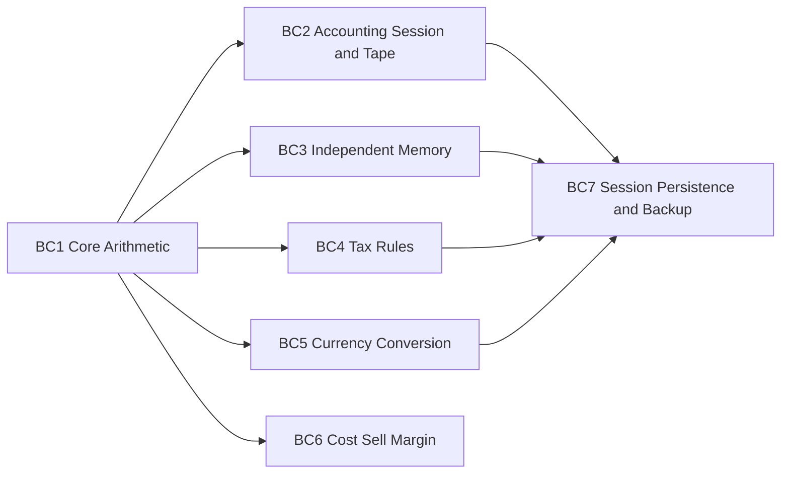
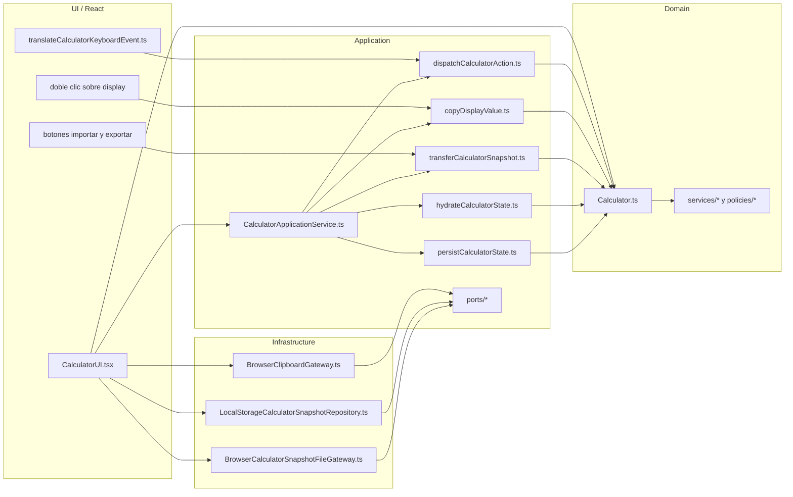
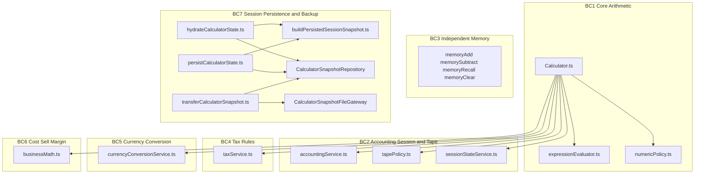
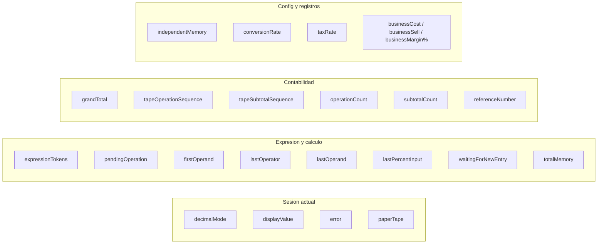
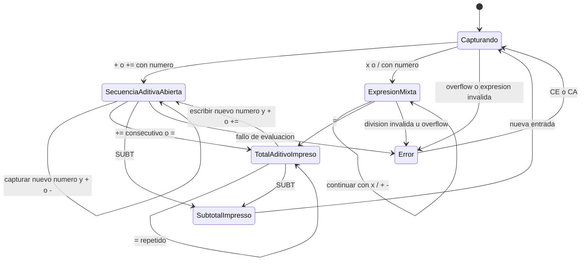
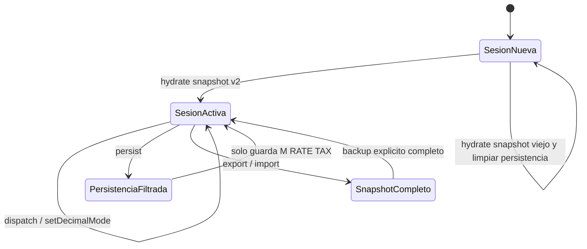
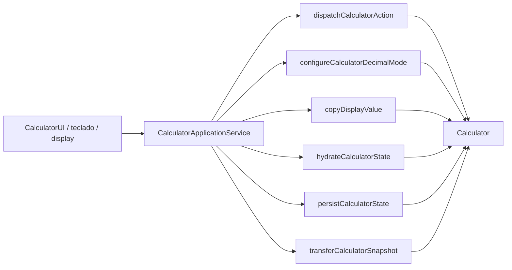
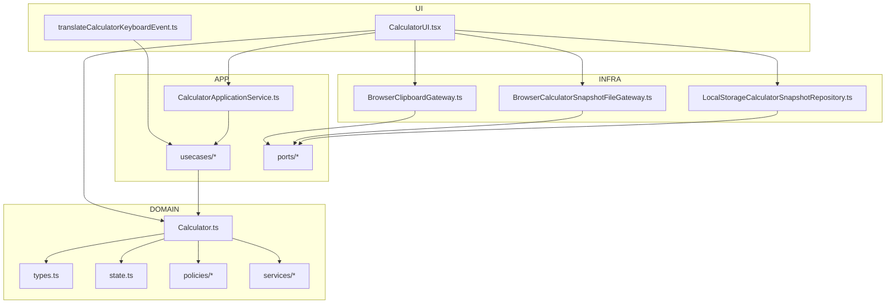

# Arquitectura y Dominio de la Sumadora

Este documento describe la arquitectura actual de la app haciendo match con el repo real, no con una version idealizada.

El objetivo no es fingir una plataforma enorme. El objetivo es mostrar una app pequena con decisiones de arquitectura deliberadas:

- dominio explicito
- limites de contexto razonables
- framework tratado como detalle
- persistencia y capacidades del navegador aisladas
- comportamiento contable modelado donde corresponde

## 1. Intencion de diseno

La app no se piensa como una "calculadora React con botones", sino como una sumadora contable con:

- una sesion operativa
- una cinta de papel
- reglas de subtotal y grand total
- una tecla combinada `+ =` con semantica propia
- memoria y configuraciones reutilizables
- detalles web/PWA encapsulados fuera del dominio

El proyecto aplica ideas de `Domain-Driven Design`, `Bounded Context` y `Clean Architecture` en proporcion al problema:

- no hay microservicios ni modulos separados por despliegue
- si hay lenguaje del dominio, agregado principal, servicios de dominio, puertos y adaptadores
- los bounded contexts son logicos, no fisicos

## 2. Principios de construccion

### 2.1 Domain-Driven Design en proporcion

El dominio gira alrededor del agregado `Calculator`:

- estado de sesion
- expresion actual
- contadores `OPS` y `SUB`
- memoria independiente
- `GT`
- tasa fiscal
- tasa de conversion
- registros de negocio `COST / SELL / MGN`

La logica pura que ya tenia frontera propia fue extraida a servicios y policies:

- `src/domain/calculator/policies/numericPolicy.ts`
- `src/domain/calculator/policies/tapePolicy.ts`
- `src/domain/calculator/services/expressionEvaluator.ts`
- `src/domain/calculator/services/accountingService.ts`
- `src/domain/calculator/services/taxService.ts`
- `src/domain/calculator/services/currencyConversionService.ts`
- `src/domain/calculator/services/businessMath.ts`
- `src/domain/calculator/services/sessionStateService.ts`

### 2.2 Bounded Contexts

Los bounded contexts aqui no son proyectos aparte. Son fronteras logicas dentro del mismo codigo.

### 2.3 Clean Architecture

La regla aplicada en este repo es simple:

- `domain` no conoce React ni APIs del navegador
- `application` coordina casos de uso y puertos
- `infrastructure` implementa puertos concretos del navegador
- `ui` renderiza, captura eventos y delega

## 3. Mapa real por capas

### 3.1 Domain

Archivos principales:

- `src/domain/calculator/Calculator.ts`
- `src/domain/calculator/types.ts`
- `src/domain/calculator/state.ts`
- `src/domain/calculator/policies/*`
- `src/domain/calculator/services/*`

Responsabilidades:

- reglas aritmeticas
- sesion contable
- semantica de `+ =`
- subtotales y grand total
- impuestos
- conversion
- calculos de negocio
- limpieza y errores

### 3.2 Application

Archivos principales:

- `src/application/services/CalculatorApplicationService.ts`
- `src/application/usecases/dispatchCalculatorAction.ts`
- `src/application/usecases/configureCalculatorDecimalMode.ts`
- `src/application/usecases/copyDisplayValue.ts`
- `src/application/usecases/hydrateCalculatorState.ts`
- `src/application/usecases/persistCalculatorState.ts`
- `src/application/usecases/buildPersistedSessionSnapshot.ts`
- `src/application/usecases/transferCalculatorSnapshot.ts`
- `src/application/ports/*`

Responsabilidades:

- traducir intenciones de la UI a casos de uso
- hidratar sesion
- persistir solo la parte que sobrevive entre sesiones
- exportar e importar snapshots
- copiar el display via puerto

### 3.3 Infrastructure

Archivos principales:

- `src/infrastructure/persistence/LocalStorageCalculatorSnapshotRepository.ts`
- `src/infrastructure/files/BrowserCalculatorSnapshotFileGateway.ts`
- `src/infrastructure/clipboard/BrowserClipboardGateway.ts`

Responsabilidades:

- `localStorage`
- File APIs del navegador
- Clipboard API del navegador

### 3.4 UI

Archivos principales:

- `src/ui/components/CalculatorUI.tsx`
- `src/ui/components/CalculatorUI.css`
- `src/ui/keyboard/translateCalculatorKeyboardEvent.ts`

Responsabilidades:

- render
- botones
- teclado fisico
- doble clic sobre display
- scroll de la cinta

## 4. Bounded Contexts aterrizados a codigo

## 5. Lenguaje del dominio actual

Conceptos vigentes en el repo:

- `ADD2`
- `OPS`
- `SUB`
- `GT`
- `paper tape`
- `tape operation sequence`
- `tape subtotal sequence`
- `independent memory`
- `reference number`
- `tax rate`
- `conversion rate`
- `business cost sell margin percentage`
- `plus-equals`
- `percentage intent`

Conceptos historicos removidos del modelo actual:

- `PRINT`
- `ON`
- `OFF`
- `ITEM`
- `NORMAL`
- `CONVERSION`

La app actual ya no normaliza esos conceptos para snapshots viejos. Los snapshots anteriores a la version `2` se rechazan por diseno.

## 6. Estado del agregado

El agregado `Calculator` mantiene un estado unico con cuatro grupos principales:

La distincion importante es esta:

- `operationCount` y `subtotalCount` describen la sesion contable visible en display
- `tapeOperationSequence` y `tapeSubtotalSequence` describen identidad de renglones impresos en cinta
- `businessMargin` representa porcentaje, no importe monetario
- la forma actual de impresion para cierres contables es `SUB nnnn OPS x valor` y `SUB nnnn GT x valor`

## 7. Maquina de estados del flujo aditivo

La pieza mas importante del dominio actual es la semantica de sumadora para `+ =`.

Correspondencia con codigo:

- `plusEquals()` decide si `+=` agrega linea o cierra secuencia
- `performOperation()` abre y extiende secuencias
- `equals()` cierra expresiones y totales
- `continueFromClosedResult()` permite seguir acumulando desde el total impreso
- `subtotal()` consume el total corrido y resetea la sesion operativa

## 8. Maquina de estados de sesion y persistencia

La sesion operativa y la persistencia automatica ya no son la misma cosa.

Regla de negocio vigente:

- la sesion actual contiene cinta, `GT`, `OPS`, `SUB`, display y expresion
- la cinta mantiene dos secuencias de dominio: `OP` para renglones operativos y `SUB` para cierres contables
- entre sesiones solo sobreviven `M`, `RATE` y `TAX`
- import/export si mueve snapshots completos

Eso se implementa en:

- `src/application/usecases/buildPersistedSessionSnapshot.ts`
- `src/application/usecases/hydrateCalculatorState.ts`
- `src/application/usecases/persistCalculatorState.ts`
- `src/application/usecases/transferCalculatorSnapshot.ts`

## 9. Capacidades siempre disponibles

El producto actual ya no usa modos globales de trabajo.

Reglas asociadas:

- la memoria independiente esta siempre disponible
- `RATE`, `CONV ->` y `<- CONV` son capacidades directas
- la conversion no cambia la personalidad de la maquina; solo ejecuta una funcion
- el indicador `M ON/OFF` del display solo informa si la memoria independiente esta vacia o no

## 10. Casos de uso de aplicacion

## 11. Detalle por detalle: que logica usa que detalle y por que

### 11.1 Dominio

Usa:

- numeros
- expresiones
- contadores
- reglas de subtotal
- reglas fiscales
- conversion monetaria
- reglas de negocio `COST / SELL / MGN`

No usa:

- React
- DOM
- `localStorage`
- `navigator.clipboard`
- File APIs

Por que:

- esas capacidades no pertenecen a la regla contable

### 11.2 Aplicacion

Usa:

- puertos
- coordinacion de casos de uso
- filtro de persistencia

No usa:

- detalles concretos del navegador directamente

Por que:

- debe coordinar, no acoplarse al entorno

### 11.3 Infraestructura

Usa:

- `localStorage`
- `navigator.clipboard`
- `Blob`
- `File.text()`
- `URL.createObjectURL`

Por que:

- ahi viven los detalles del runtime web/PWA

### 11.4 UI

Usa:

- React state
- eventos DOM
- doble clic
- keydown
- scroll

Por que:

- render e interaccion pertenecen al borde del sistema

## 12. Grafo de dependencias real

## 13. Como se creo la app con estos enfoques en mente

La forma actual del repo no surgio de una sola reescritura. Surgio de refactors sucesivos guiados por fronteras.

Secuencia conceptual:

1. Separar el motor del render.
2. Hacer visible la capa `application`.
3. Mover navegador y persistencia a `infrastructure`.
4. Extraer reglas puras repetibles del agregado.
5. Corregir reglas de negocio en el dominio y no en la UI.
6. Documentar decisiones con ADRs pequenas.

El mejor ejemplo de esa evolucion es `+ =`:

- primero parecia un detalle de boton
- despues se descubrio que era una regla del dominio contable
- finalmente quedo modelada en `Calculator.plusEquals()`

El segundo ejemplo es persistencia:

- al inicio "persistir snapshot" parecia equivalente a "persistir sesion"
- despues se descubrio que `GT`, `SUB`, `OPS` y cinta no debian sobrevivir
- finalmente se separo backup completo de persistencia automatica filtrada

El tercer ejemplo es modo de trabajo:

- primero parecia razonable conservar `NORMAL` y `CONVERSION`
- despues se observo que conversion ya tenia teclas propias y memoria no debia bloquearse
- finalmente se eliminaron los modos y se acepto ruptura de snapshots viejos para limpiar el dominio

## 14. Que parte si es DDD y que parte no

Si es DDD en proporcion:

- agregado principal
- lenguaje del dominio
- bounded contexts logicos
- decisiones de producto aterrizadas al dominio
- comportamiento importante protegido por pruebas

No es DDD ceremonial:

- no hay repositories de dominio
- no hay event bus interno
- no hay factories complejas
- no hay multiples aggregates colaborando por transacciones

Eso es intencional. El proyecto busca claridad y buen juicio, no inflar la complejidad.

## 15. Limites actuales

- `Calculator.ts` sigue siendo un orquestador grande
- `expressionTokens` mezcla bien el modelo de calculadora y el de sumadora, aunque ya mejor delimitado
- `GT` y `SUBT` siguen siendo parte del mismo agregado, no un submodelo separado
- la persistencia filtrada existe como caso de uso de aplicacion, no como politica declarativa separada

## 16. Lectura recomendada del repo

Si alguien quiere entender el sistema en orden:

1. `src/domain/calculator/types.ts`
2. `src/domain/calculator/state.ts`
3. `src/domain/calculator/Calculator.ts`
4. `src/domain/calculator/services/*`
5. `src/application/services/CalculatorApplicationService.ts`
6. `src/application/usecases/*`
7. `src/ui/components/CalculatorUI.tsx`
8. `src/infrastructure/*`
9. `docs/adr/*`

## 17. Conclusion

La app actual ya no es solo un monolito de UI.

Tampoco es una arquitectura corporativa sobredimensionada.

Es una sumadora web/PWA pequena con:

- un dominio real
- contextos logicos distinguibles
- clean architecture ligera
- reglas de negocio movidas hacia donde deben vivir
- documentacion arquitectonica que ya puede leerse junto con el codigo sin romperse con facilidad
